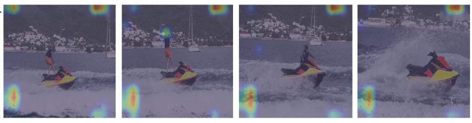
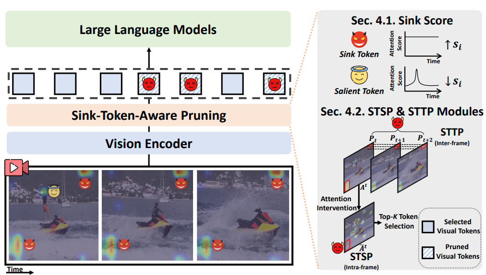

#  Sink-Token-Aware Pruning for Fine-Grained Video Understanding in Efficient Video LLMs

[](https://img.shields.io/badge/Task-Visual_Token_Pruning-blue)
[](https://img.shields.io/badge/Model-Video_LLMs-green)
[](https://img.shields.io/badge/Status-Under_Review-orange)

The official source code for [Sink-Token-Aware Pruning for Fine-Grained Video Understanding in Efficient Video LLMs](https://arxiv.org/pdf/2604.20937v1).

## Overview

### Key Finding: Sink Tokens as an Obstacle

<p align="center">
  
</p>

Through a systematic analysis, we identify **sink tokens** — semantically uninformative tokens that attract excessive attention — as a key obstacle to fine-grained video understanding. When sink tokens survive pruning, they distort the model's visual evidence and hinder fine-grained understanding.

- **Sink tokens** exhibit spatially persistent high attention across the temporal dimension despite carrying little semantic information.
- Due to their high attention weights, sink tokens are **preferentially retained** during spatial pruning, crowding out truly informative tokens.

### Proposed Approach: SToP

<p align="center">
  
</p>

We propose **Sink-Token-aware Pruning (SToP)**, a simple yet effective plug-and-play method consisting of:

1. **Sink Score** — Quantifies each token's tendency to behave as a sink by measuring the persistence of its attention across frames.
2. **STSP Module** (Sink-Token-aware Spatial Pruning) — Adjusts the attention distribution of sink tokens, lowering their priority for retention during spatial pruning.
3. **STTP Module** (Sink-Token-aware Temporal Pruning) — Further promotes the elimination of sink tokens along the time dimension.

SToP is **agnostic to existing pruning frameworks** and can be seamlessly integrated with VisionZip, FastVid, and HoliTom.

## Installation

Set up the environment with a single command:

```bash
bash environment.sh
```

Main package versions:

> torch 2.2.1 (CUDA 12.1)
> transformers 4.51.3
> numpy 1.26.1

## Dataset

Each benchmark has its own download script — run only the ones you need.

### Fine-grained tasks

```bash
cd dataset/fine_grained_task

bash download_EventHallusion.sh   # EventHallusion
bash download_VCGBench.sh         # VCGBench (VideoChatGPT)
bash download_VideoComp.sh        # VideoComp (ActivityNet + YouCook2)
```

### VQA benchmarks

```bash
cd dataset/VQA

bash download_videomme.sh         # Video-MME
bash download_mvbench.sh          # MVBench
bash download_mlvu.sh             # MLVU
```

## Evaluation

This repository supports 3 backbones, each with its own scripts directory:

| Backbone | Scripts directory |
|---|---|
| LLaVA-OneVision | [`scripts/llava_ov/`](scripts/llava_ov) |
| LLaVA-Video | [`scripts/llava_video/`](scripts/llava_video) |
| Qwen2.5-VL | [`scripts/qwen2.5_vl/`](scripts/qwen2.5_vl) — VisionZip only (see folder README) |

Supported pruning methods:
[VisionZip](https://arxiv.org/pdf/2412.04467),
[FastVid](https://arxiv.org/pdf/2503.11187),
[HoliTom](https://arxiv.org/pdf/2505.21334),
[PruneVid](https://arxiv.org/pdf/2412.16117), and
[FlashVid](https://arxiv.org/pdf/2602.08024).

### Quick start

Every backbone directory follows the same 4-file layout. Replace `{MODEL}` with `llava_ov`, `llava_video`, or `qwen2.5_vl`.

```bash
# No pruning (vanilla)
bash scripts/{MODEL}/no_pruning.sh

# Pruning without SToP
bash scripts/{MODEL}/baseline.sh

# SToP — spatial only (VisionZip, FastVid)
bash scripts/{MODEL}/SToP_spatial.sh

# SToP — spatial + temporal (HoliTom)
bash scripts/{MODEL}/SToP_spatial_temporal.sh
```

Inside each script you can adjust `DATASET`, `RETENTION_RATIO`, `PRUNING`, and `CUDA_VISIBLE_DEVICES`. The SToP hyperparameters ($\mu_s$, $\mu_t$) are set automatically per backbone and pruning method via [`eval/utils/config.py`](eval/utils/config.py) — no manual tuning needed.

> `OPENAI_KEY` is required for GPT-based evaluation on **VCGBench** and **EventHallusion**. Set it at the top of the script before running.

## Acknowledgement

This code is built upon [LLaVA-NeXT](https://github.com/LLaVA-VL/LLaVA-NeXT), [VisionZip](https://github.com/dvlab-research/VisionZip), [FastVid](https://github.com/LunarShen/FastVID), [PruneVid](https://github.com/visual-ai/prunevid), [FlashVid](https://github.com/Fanziyang-v/FlashVID), and [HoliTom](https://github.com/cokeshao/HoliTom).

## Citation

If you find this work useful, please cite:

```bibtex
@article{kim2026sink,
  title={Sink-Token-Aware Pruning for Fine-Grained Video Understanding in Efficient Video LLMs},
  author={Kim, Kibum and Kim, Jiwan and Min, Kyle and Wang, Yueqi and Moon, Jinyoung and McAuley, Julian and Park, Chanyoung},
  journal={arXiv preprint arXiv:2604.20937},
  year={2026}
}
```
